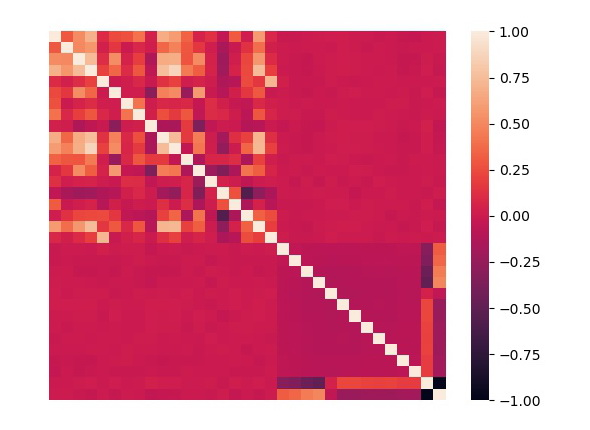
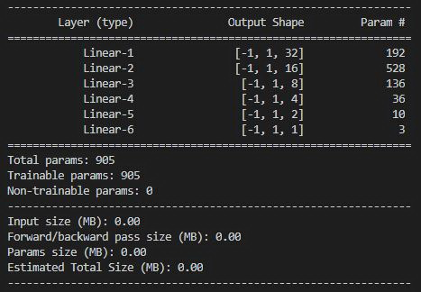
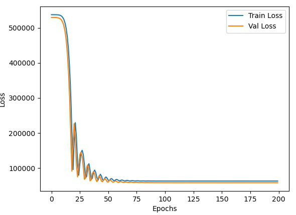
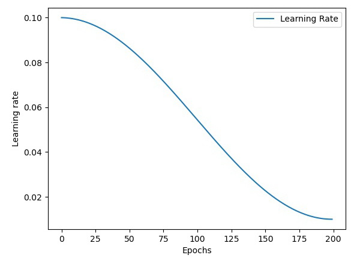

[](https://classroom.github.com/online_ide?assignment_repo_id=3629422&assignment_repo_type=AssignmentRepo)
## 目錄

1. [資料預處理](#資料預處理)
2. [流程圖](#流程圖)
3. [模型架構](#模型架構)
4. [訓練設置](#訓練設置)
5. [結果分析](#結果分析)
6. [後續改進](#後續改進)
7. [參考資料](#參考資料)
## 資料預處理

1. 讀取訓練集，將“id”與“sale_day”整行丟棄，然後將“sale_month”與“sale_yr”做 Onehot encoding，並丟棄“年”、“月”兩行，把沒有意義的數字轉換為有意義的數字。
``` 
# 將“id”與“sale_day”整行丟棄
train = train.drop([
    'id',
    'sale_day',
], axis=1)
# one hot encoding
cate_feature = ['sale_month', 'sale_yr']
for item in cate_feature:
    le = LabelEncoder()
    train[item] = le.fit_transform(train[item])
    item_dummies = pd.get_dummies(train[item])
    item_dummies.columns = [
        item + str(i + 1) for i in range(item_dummies.shape[1])
    ]
    train = pd.concat([train, item_dummies], axis=1)
train.drop(cate_feature, axis=1, inplace=True)
``` 
2. 計算整個訓練集的整體相關係數，觀察各個係數之間的關係，正一代表與價錢正相關，負一代表與價錢負相關，最後並繪製成熱像圖。
``` 
# 計算相關係數
corr = train.corr()
# 查看跟價錢相關的係數
print(corr['price'])
>>>
price            1.000000
bedrooms         0.301817
bathrooms        0.521330
sqft_living      0.702100
sqft_lot         0.101519
floors           0.241054
waterfront       0.266653
view             0.404273
condition        0.040836
grade            0.672523
sqft_above       0.601167
sqft_basement    0.337082
yr_built         0.057491
yr_renovated     0.129219
zipcode         -0.052930
lat              0.309688
long             0.020066
sqft_living15    0.586408
sqft_lot15       0.078428
sale_month1     -0.010301
sale_month2     -0.013121
sale_month3      0.003557
sale_month4      0.013009
sale_month5      0.021584
sale_month6      0.030175
sale_month7      0.000445
sale_month8      0.000212
sale_month9     -0.009657
sale_month10    -0.004832
sale_month11    -0.019185
sale_month12    -0.028463
sale_yr1        -0.007752
sale_yr2         0.007752
``` 
```
# 將相關係數轉為熱點圖
sns.heatmap(corr, xticklabels=False, yticklabels=False)
plt.show()
```  
   
3. 將處理過的資料刪除刪除“price”，並使用cross_val_score與簡單的回歸模型訓練，在這裡共切割成十等分進行訓練驗證，並得到評估指標mae的分數。
``` 
# 刪除 price
train = train.drop(['price'], axis=1)
# 設定模型
estimator = LinearRegression()
# 原始特徵 + Logistic Regression
ss = StandardScaler()
train_x = ss.fit_transform(train)
org_cross_val_score = -cross_val_score(estimator,
                                       train_x,
                                       train_y,
                                       scoring='neg_mean_absolute_error',
                                       cv=10,
                                       verbose=1).mean()
``` 
``` 
print('org_cross_val_score:', round(org_cross_val_score, 4))
>>>
org_cross_val_score: 125207.2466
```
4. 設定閥值進行篩選，並將篩選過後的特徵重新訓練一次，並與原始特徵進行分數比較，重複上述動作直到找出最好的閥值。
```
Threshold = 0.005
high_list = list(corr[(corr['price'] > Threshold) |
                      (corr['price'] < Threshold * -1)].index)
high_list.pop(0)

# 篩選後特徵 + Logistic Regression
ss = StandardScaler()
train_x = ss.fit_transform(train[high_list])
change_cross_val_score = -cross_val_score(estimator,
                                          train_x,
                                          train_y,
                                          scoring='neg_mean_absolute_error',
                                          cv=10,
                                          verbose=1).mean()
print('change_cross_val_score:', round(change_cross_val_score, 4))
print('原始特徵數量:', train.shape[1])
print('篩選後特徵數量:', len(high_list))
print('分數變化:', round((org_cross_val_score - change_cross_val_score), 4))
>>>
change_cross_val_score: 125171.3211
原始特徵數量: 32
篩選後特徵數量: 28
分數變化: 35.9256
```
5. 經過重複測試，找出最好的閥值0.005，可以讓特徵數量從32降至28，並使得 MAE 降了35.9。
## 流程圖

1. 流程圖如下所示：  

2. 本次利用多個多個弱回歸學習器結合成一個強回歸學習器的概念，將五個回歸器利用DNN結合在一起。五個回歸學習器分別為XGBoost、AdaBoost、Random Forest、KNN及SVM。
3. 訓練集、驗證集及測試集利用Stacking的方法生成出來，K-fold設置為10。
## 模型架構

1. 利用 torchsummary 將模型參數顯示出來。  

2. 利用 tensorboard 將模型可視化。  

## 訓練設置

1. 損失函數選擇使用SmoothL1Loss，優化器選擇Adam，學習率初始值設置0.1，並使用CosineAnnealingLR學習率下降法，學習率最終降至0.01，共訓練200個Epochs。
## 結果分析

1. 訓練損失最終下降至6.33e-4，而驗證損失最終下降至5.86e-4。  

2. 使用CosineAnnealingLR學習率下降法，從0.1降至0.01。  

## 後續改進

未來可以對訓練集做進一步的特徵分析以及特徵篩選，濾除掉較離群的特徵，讓模型的預測能力得到近一步的提升。

## 參考資料

1. ##### 實戰：使用PyTorch構建神經網絡進行房價預測 @[ilulaoshi](https://juejin.cn/post/6885614731982766088)
2. ##### Tatanic機器學習模型stacking整理 @[Morris Tai](https://medium.com/@morris_tai/tatanic%E6%A9%9F%E5%99%A8%E5%AD%B8%E7%BF%92%E6%A8%A1%E5%9E%8Bstacking%E6%95%B4%E7%90%86-523884f3bb98)
3. ##### 如何為你的回歸問題選擇最合適的機器學習方法？ @[何从庆](http://www.python88.com/topic/31695)
4. ##### ML100Days-030 特徵選擇 @[ChengChe-Hsieh](https://medium.com/@z1334879568/ml100days-030-%E7%89%B9%E5%BE%B5%E9%81%B8%E6%93%87-d2a73ecee6bb)
5. ##### 數據挖掘類比賽常用模型 @[浅蓝苜蓿 QLMX](https://github.com/QLMX/data_mining_models)
